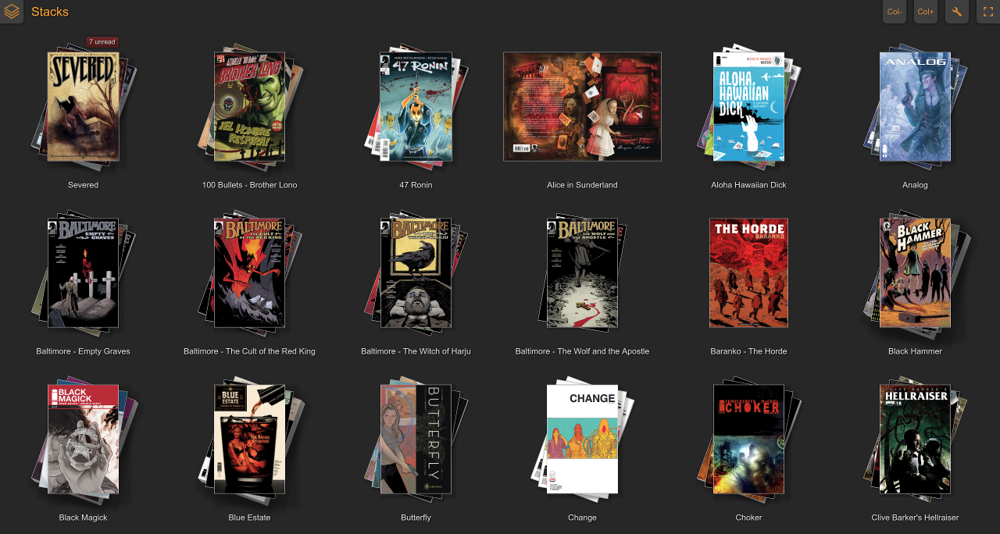
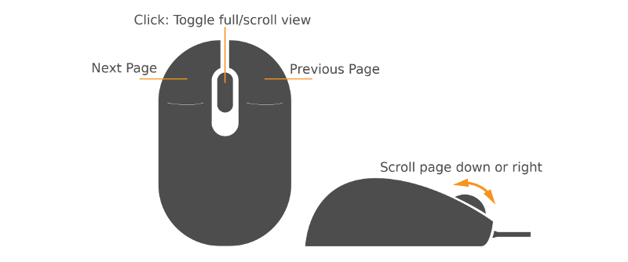
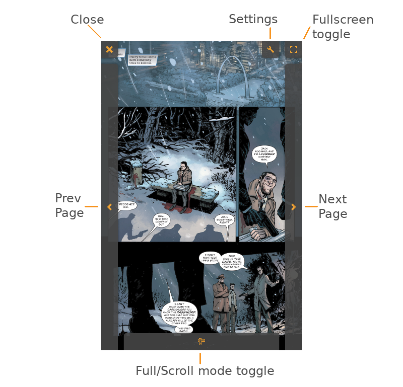

# Stacks - CBR comic library renderer and reader
Stacks is a reader for digital comics in CBR/CBZ format. It runs as a fullscreen browser-based web application on any modern device, preferrably tablets or laptops. The server can be run on Linux or Windows.



## Install on Windows
* Download the installer here: https://dl.bintray.com/duncanthrax/windows/StacksInstaller.exe
* Run the installer.
* Run stacks from the final installer page or the Start Menu. It should open a browser window.
* In Settings, provide the path to your Comics library. Use standard Windows drive/path notation (e.g. "X:\Files\Comics").

## Install on Linux
DEBs for recent systemd-based Debian variants (including Ubuntu) on amd64 are available from a BinTray repo.

Import Bintray's GPG signing key (you might have it already)
```
wget -qO - https://bintray.com/user/downloadSubjectPublicKey?username=bintray | sudo apt-key add -
```

Add this line to /etc/apt/sources.list
```
deb [arch=amd64] https://dl.bintray.com/duncanthrax/deb systemd main
```

Update, install and start. The DEB package is called "comic-stacks" because "stacks" was already taken.
```
sudo apt-get update
sudo apt-get install comic-stacks
sudo service stacks start
```

Point your browser to ```http://<IP>:4472```. On successful load, you should see your still empty library. Click the settings (wrench) icon in the top right corner. Specify the path to your comic library. Click "Apply and redo initial scan" to let Stacks read your comic library.

## Using stacks
Navigation on the stacks and book screens should be more or less obvious. The reader can either be controlled with mouse buttons and scroll wheel (on desktops) or by tapping screen edges and corners (tablets/touch screens).

### Reader mouse controls (for desktops)
Simple mouse controls allow for single-handed, reclined reading:


### Reader touch controls
The touch controls are normally invisible, shown here for illustration purposes:


## Adding authentication and encryption
Stacks does not come with user authentication and SSL capabilities, but one or both can easily be added by fronting Stacks with nginx.
